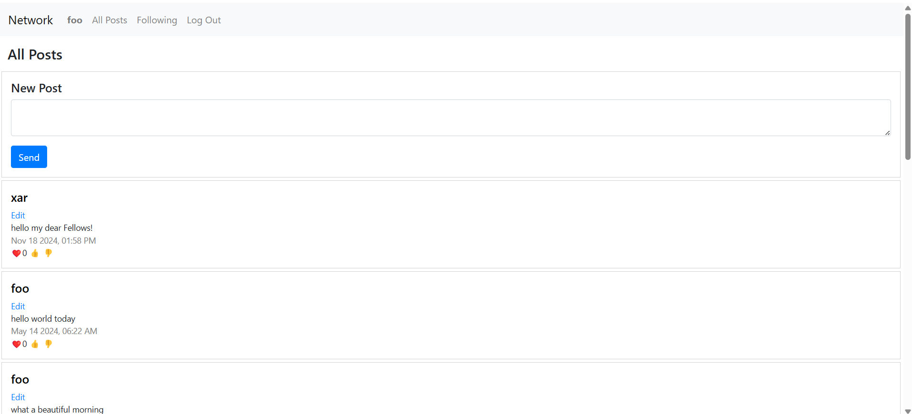
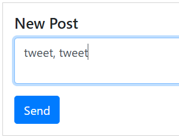
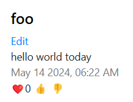
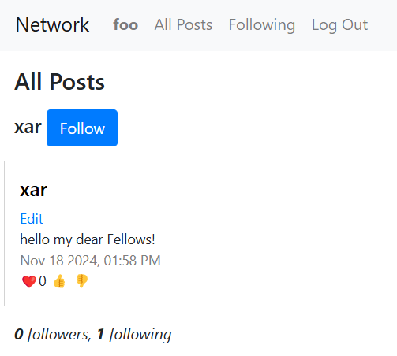
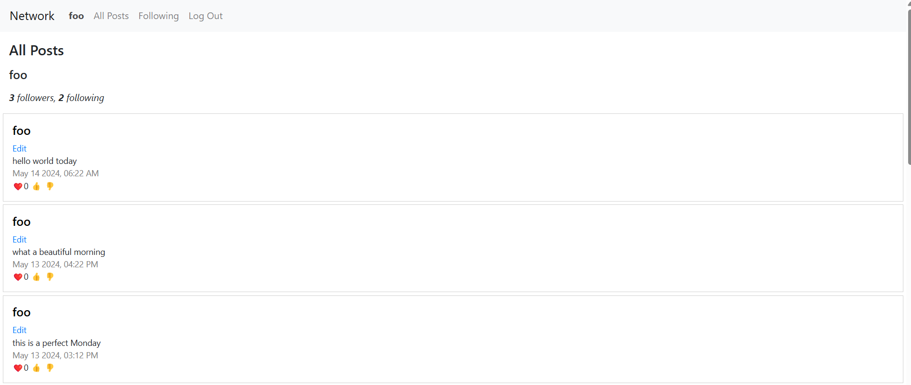

# Network App

A basic Django web project to illustrate Twitter-like features like creating online posts, submitting likes/dislikes and following/unfollowing other users. Link to video presentation: https://youtu.be/ufH4Tnw18H0

## Requirements

To install the required packages, run:

```sh
pip install -r requirements.txt
```
## Features
Basic screen shows you a list of most recent posts:


You can create a new post by filling the body and clicking on the "Send" button:



Each post has a user, body, date, number of likes and dislikes and three buttons: like, dislike and follow. You can like or dislike a post by clicking on the respective button.



You can follow or unfollow a user by clicking on its username and then by clicking "Follow" of "Unfollow" button.  


When you click on your username in the top navigation bar, you will get your profile stats and a list of all your followed posts:


## Implementation details
It was implemented in Python (Django) and Javascript. Users can add and edit posts, give and take likes, follow other users. Similarly to the original Twitter, the website was designed as a single-page app, so it relies heavily on Javascript and renders only one index.html template. It intesively uses AJAX technology of asynchronous fetch calls from server, without a need to reload the entire page. I used Python's Paginator class in order to implement dynamic server-side pagination of posts (10 per page) in order not to overload the page with unnecessary content. 

## Endpoints
### Posts
- `GET /posts/` - Retrieve all posts 
- `GET /posts/<post_id>/` - Retrieve a specific post
- `POST /posts/` - Create a new post
- `PUT /posts/<post_id>/` - Update a post
- `DELETE /posts/<post_id>/` - Delete a post

### User profiles
- `GET /profile/<user_id>/` - Retrieve a user profile
- `GET /profile/<user_id>/follow/` - Follow a user
- `GET /profile/<user_id>/unfollow/` - Unfollow a user
- `GET /profile/<user_id>/followers/` - Retrieve followers of a user
- `GET /profile/<user_id>/following/` - Retrieve users followed by a user

## Data model
Here is a diagram representing the data model for the project:

```plaintext
+-----------------+                   
|      User       |          
+-----------------+          
| - id            |<--+      
| - username      |   |      
| - password      |   |      
| - email         |   |      
| - first_name    |   |      
| - last_name     |   |      
+-----------------+   |
                      |
                      |
                      +--------------------+
                      |                    |
                      |                    |
                      v                    v
                +-----------------+  +-----------------+
                |      Post       |  |    Following    |
                +-----------------+  +-----------------+
                | - user_id       |  | - follower_id   |
                | - body          |  | - following_id  |
                | - timestamp     |  +-----------------+
                | - likes         |
                +-----------------+
```

- **User**: Represents a user in the system.
- **Post**: Represents a post created by a user.
- **Following**: Represents the relationship where one user follows another.

The arrows indicate foreign key relationships:
- A `Post` is linked to a `User` through the `user_id` foreign key.
- A `Following` relationship is linked to two `User` instances through the `follower_id` and `following_id` foreign keys.


## Running the Project
To run the project, use the following command
`python manage.py runserver`

### License
This project is licensed under the MIT License.